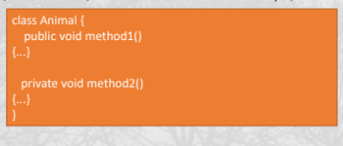

# Access Modifier
- Access modifiers are keywords that determine the accessibility of a class, method, constructor, or field.

method1 is public - This means it can be accessed by other classes.
method2 is private - This means it can not be accessed by other classes.

## Types of Access Modifiers
1. **Private**: The private access modifier is accessible only within the class.
2. **Default**: The default access modifier is accessible only within the package.
3. **Protected**: The protected access modifier is accessible within the package and outside the package through inheritance.
4. **Public**: The public access modifier is accessible from anywhere.

# Class
 - A class is a blueprint for objects. We can create an object from a class.
  - A class can contain fields, methods, constructors, blocks, and interfaces.
  1. **Fields**: Fields represent data pertaining to objects.
  2. **Methods**: Methods represent actions.
  3. **Constructors**: Constructors are invoked when an object of a class is created.
## Variable Type
  1. Local Variable - A variable declared inside the body of the method is called a local variable.
  2. Instance Variable - A variable declared inside the class but outside the body of the method is called an instance variable.
  3. Class Variable - A variable declared with the static keyword is called a class variable.
 

